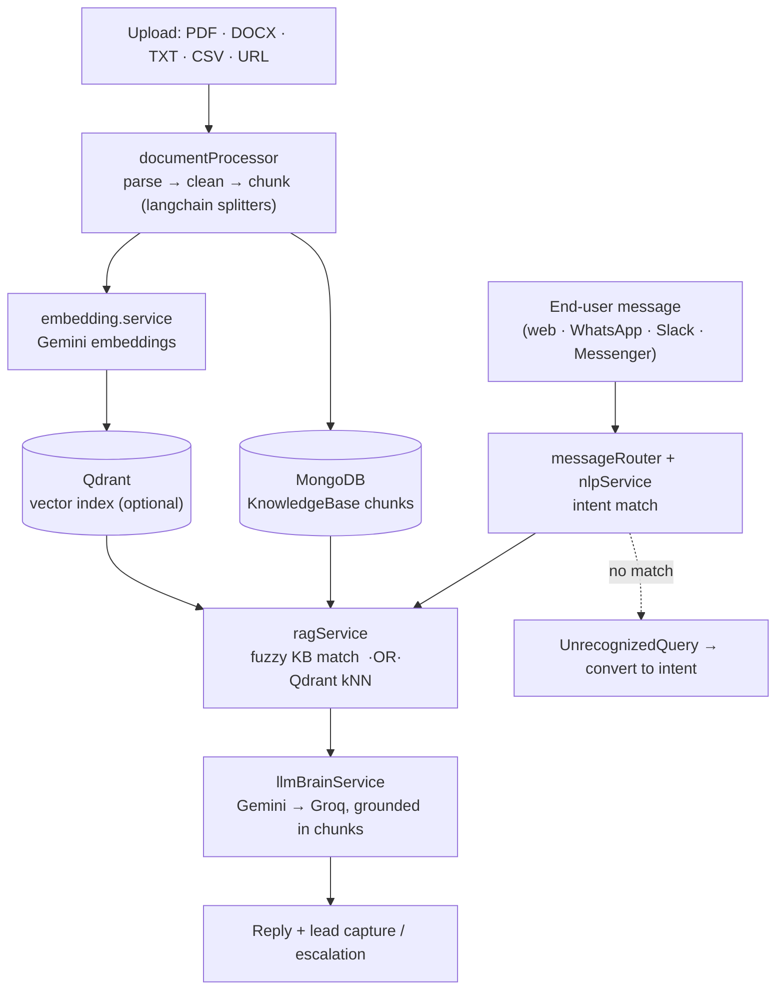

<div align="center">

<pre>
                        _           _           _
   ___  _ __ ___  _ __ (_)_ __ ___ (_)_ __   __| |
  / _ \| '_ ` _ \| '_ \| | '_ ` _ \| | '_ \ / _` |
 | (_) | | | | | | | | | | | | | | | | | | | (_| |
  \___/|_| |_| |_|_| |_|_|_| |_| |_|_|_| |_|\__,_|
</pre>

**Build a support chatbot from your own docs, train it on real misses, and ship it to WhatsApp, Slack, or a web widget — no code.**

The app brands itself **CloudBot**.

<br/>

[](https://react.dev)
[](https://expressjs.com)
[](https://mongodb.com)
[](https://qdrant.tech)
[](https://ai.google.dev)


</div>

---

## 🤖 What is omnimind?

A tenant signs up, creates a **Bot**, and feeds it knowledge — PDFs, Word docs, plain text, CSVs, or a URL to scrape. omnimind chunks and indexes that content; at chat time it retrieves the relevant pieces and has an LLM answer **grounded in them**. Questions the bot fumbles are logged as *unrecognized queries* you can promote to intents in one click, so the bot gets better from real traffic.

> Powerful under the hood, dead simple on the surface — the Notion of AI chatbots.

Everything is **organization-scoped**: each tenant's bots, knowledge, conversations, and leads live in their own namespace behind JWT auth with refresh tokens.

| Actor | What they do |
|:---|:---|
| 🏢 **Organization owner** | create bots, upload knowledge, wire channels, watch analytics and leads |
| 🧑‍🏫 **Bot trainer** | write intents (phrases → responses), review unrecognized queries, bulk import/export |
| 💬 **End user** | chats with the deployed bot on web / WhatsApp / Slack; can be captured as a lead or escalated |

---

## ✨ What's built

- 📁 **Knowledge ingestion** — `pdf-parse` · `mammoth` (DOCX) · `turndown` + `cheerio` (URL → markdown) · CSV/TXT; split with `@langchain/textsplitters`.
- 🧠 **Two-tier RAG** — a dependency-free path (keyword + Levenshtein fuzzy match over KB chunks) and a vector path (Qdrant + Gemini embeddings). `llmBrainService` answers with **Gemini first, Groq on failure**.
- 🎯 **Intents & training** — training phrases and responses per intent; bulk create / import / export; `UnrecognizedQuery` capture → *convert to intent*.
- 🧪 **Test harness** — `POST /api/bots/:botId/test` runs a message through the full NLP + RAG pipeline before you deploy.
- 🌐 **Multi-channel** — webhook handlers for **WhatsApp (Twilio)**, **Facebook Messenger**, and **Slack**; per-bot channel config; an embeddable web widget (`/bots/:botId/embed-code`).
- 💬 **Conversations & leads** — session-based chat API (start / message / history / end / feedback), lead capture, human escalation.
- 📊 **Analytics** — per-bot analytics, usage, and vector-store stats endpoints.
- 🧩 **Templates** — spin up a bot `from-template` or `from-description`; a FAQ quick-start.
- 🔐 **Auth & tenancy** — signup / login / refresh-token, org-scoped middleware, configurable rate limiting, helmet.

---

## 🛠️ Tech Stack

| Layer | Technology |
|:---|:---|
| **Frontend** | React 19 (CRA) · React Router 6 · Tailwind CSS 3 · three.js (animated hero) · lucide-react |
| **Backend** | Node.js · Express 4 · TypeScript · `ts-node-dev` |
| **Database** | MongoDB via Mongoose 8 |
| **Vectors** | Qdrant (`@qdrant/js-client-rest`) — optional; fuzzy fallback otherwise |
| **LLM** | Google Gemini (`@google/genai`) primary · Groq (`groq-sdk`) fallback · `openai` SDK present |
| **Ingestion** | pdf-parse · mammoth · turndown · cheerio · `@langchain/textsplitters` |
| **Auth / hardening** | jsonwebtoken (+ refresh) · bcrypt · helmet · express-rate-limit · joi |

---

## 🏗️ Architecture



Backend route groups: `/api/auth` · `/api/organizations/:orgId` · `/api/bots` · `/api/chat` · `/api/webhooks` · `/api/templates`.

---

## 🚀 Getting Started

### Prerequisites

- Node.js 18+
- MongoDB (local or Atlas)
- A **Gemini** key and a **Groq** key (both free); Qdrant Cloud is optional

### Backend

```bash
git clone https://github.com/shaktivijayas/omnimind.git
cd omnimind/backend
npm install
cp .env.example .env        # set MONGODB_URI, JWT_SECRET, GEMINI_API_KEY, GROQ_API_KEY
npm run dev                  # ts-node-dev, http://localhost:3000
```

### Frontend

```bash
cd ..                       # repo root
npm install
PORT=3001 npm start         # CRA; proxies /api → http://localhost:3000
```

---

## 📁 Project Structure

```
omnimind/
├── src/                        # React SPA  ("chatbot-landing" → CloudBot)
│   ├── App.tsx                 # landing page (three.js hero, features, chat demo)
│   ├── pages/                  # Login · Signup · Dashboard · BotDetail (Overview/Intents/KB/Test)
│   ├── context/AuthContext.tsx
│   ├── api/client.ts           # fetch wrapper, JWT from localStorage
│   └── components/CustomCursor.tsx
├── backend/                    # Express API  ("cloudbot-api")
│   └── src/
│       ├── index.ts            # app wiring, rate limit, route mounts
│       ├── models/             # Bot · Conversation · Intent · KnowledgeBase · Lead · Organization · UnrecognizedQuery · User
│       ├── controllers/        # auth · bot · chat · conversation · intent · knowledgeBase · lead · organization · template · training · unrecognized · webhook
│       ├── routes/             # auth · bots · chat · organizations · templates · webhooks
│       ├── services/           # llmBrainService · ragService · vectorDB.service · embedding.service · documentProcessor · nlpService · messageRouter · channelSend/Format · botTemplates
│       └── middleware/ · config/ · types/ · utils/
├── IMPLEMENTATION_PLAN.md      # phase-by-phase status (phases 1–4 done)
└── package.json · tailwind.config.js
```

---

## 📄 License

MIT (badge). No `LICENSE` file is committed.

---

<div align="center">

`🤖 your docs in, a trained bot out`

</div>
